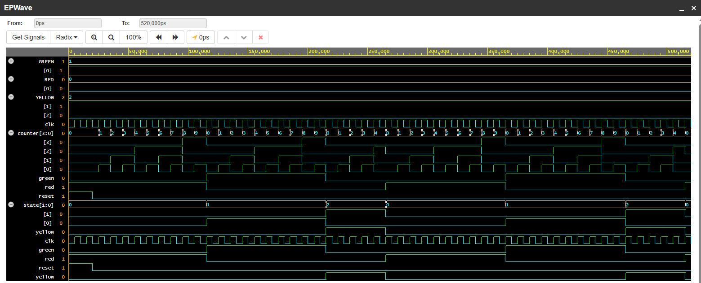
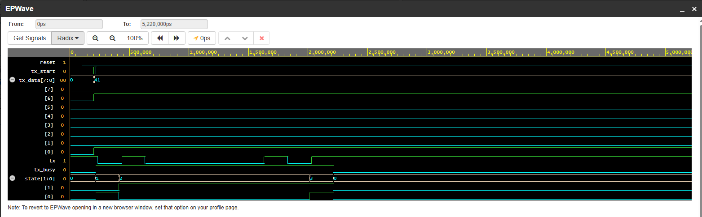
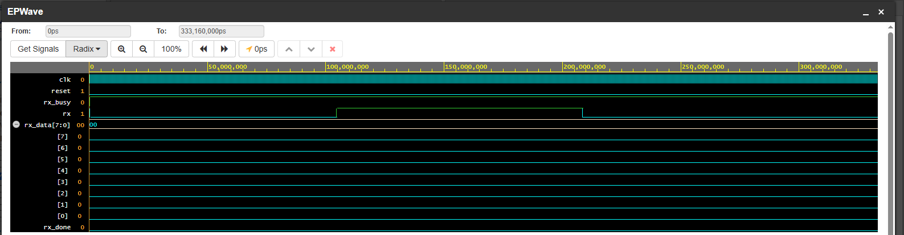
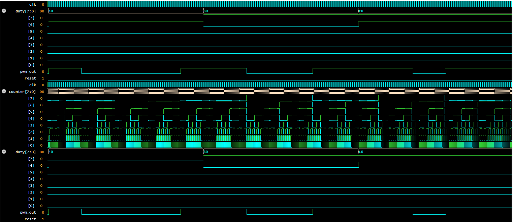
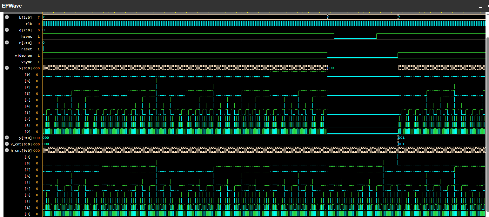
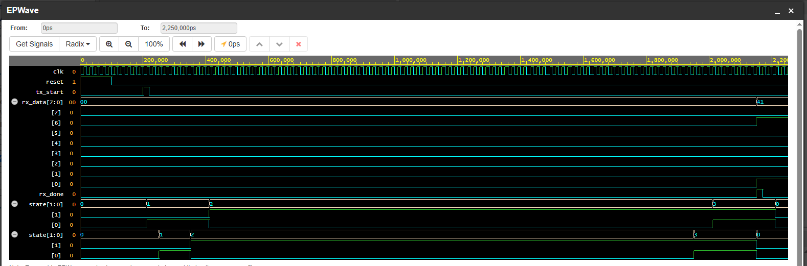

# FPGA Learning

Репозиторий для изучения ПЛИС (Verilog).

## Проекты

### Light (FSM)

Светофор на Verilog — FSM Moore.

**Что делает:**
- Три состояния: RED, GREEN, YELLOW.
- Переключение по такту с счётчиком.
- RED = 10 тактов, GREEN = 10, YELLOW = 5.

**Файлы:**
- `light/light.v` — модуль светофора
- `light/tb_light.v` — testbench

### UART TX (Verilog)

Передатчик UART на Verilog.

**Что делает:**
- Передаёт байт по линии TX.
- Формат: START, 8 бит данных, STOP.
- Бодовая скорость: 9600 (в симуляции ускорено).

**Файлы:**
- `uart_tx/uart_tx.v` — модуль передатчика
- `uart_tx/tb_uart_tx.v` — testbench

*BAUD = 5 000 000 (ускорено для симуляции).*

### UART RX (Verilog)

Приёмник UART на Verilog.

**Что делает:**
- Принимает байт по линии RX.
- Формат: START, 8 бит данных, STOP.
- Сэмплирование бит в середине для надёжности.
- Бодовая скорость: 9600 (в симуляции ускорено).

**Файлы:**
- `uart_rx/uart_rx.v` — модуль приёмника
- `uart_rx/tb_uart_rx.v` — testbench

*BAUD = 5 000 000 (ускорено для симуляции).*

### PWM (Verilog)

ШИМ-генератор на Verilog.

**Что делает:**
- Генерирует ШИМ-сигнал.
- Скважность управляется через вход `duty` (0..255).
- Частота: CLK / 256.

**Файлы:**
- `pwm/pwm.v` — модуль ШИМ
- `pwm/tb_pwm.v` — testbench

*На диаграмме: duty = 64 (25%), 128 (50%), 192 (75%).*

### UART Loopback (Verilog)

Соединение UART TX и RX — loopback.

**Что делает:**
- TX передаёт байт.
- RX принимает тот же байт.
- Проверка: отправил 0x41 → принял 0x41.

**Файлы:**
- `uart_loopback/uart_loopback.v` — соединение TX + RX
- `uart_loopback/tb_uart_loopback.v` — testbench

### VGA Controller (Verilog)

VGA-контроллер 640x480 @ 60 Гц.

**Что делает:**
- Генерирует HSYNC и VSYNC.
- Координаты пикселя (x, y).
- Сигнал video_on для видимой области.

**Файлы:**
- `vga/vga_controller.v` — контроллер
- `vga/tb_vga.v` — testbench

